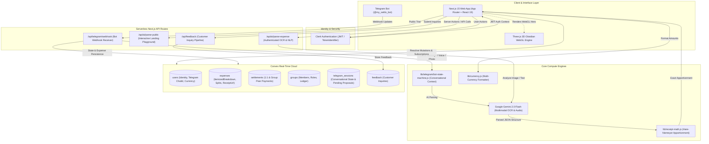
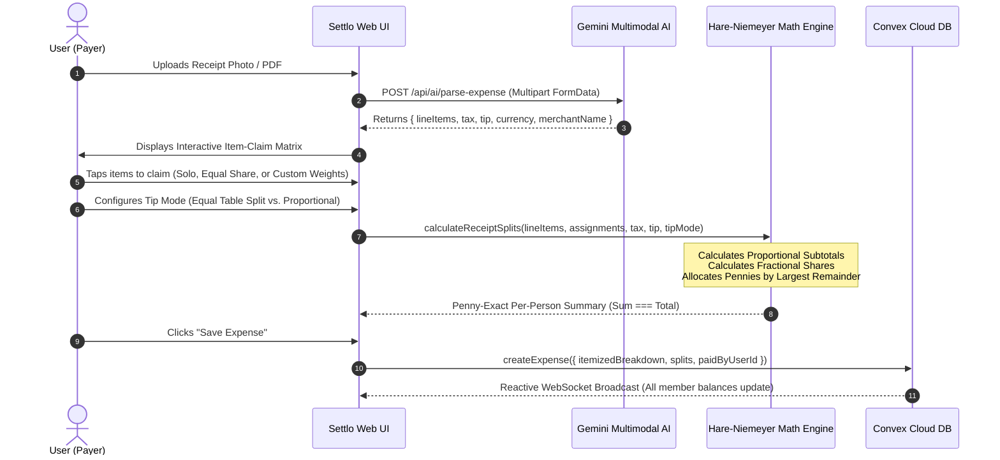
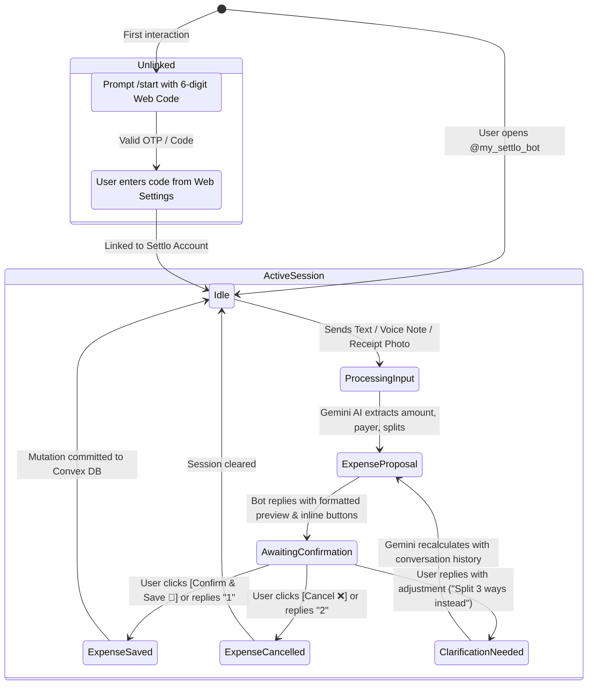
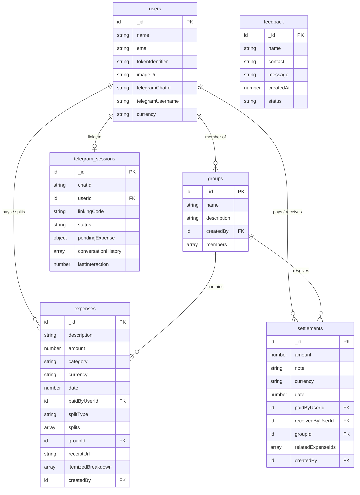

<div align="center">

# 💸 Settlo — The Intelligent Expense & Settlement Engine

**One unified, intelligent layer for shared finances. Split dining bills item-by-item, parse messy group expenses in natural language & Hinglish, and log bills on the fly with a 24/7 Telegram AI bot.**

[](https://nextjs.org/)
[](https://react.dev/)
[](https://convex.dev/)
[](https://aistudio.google.com/)
[](https://clerk.com/)
[](https://threejs.org/)
[](https://opensource.org/licenses/MIT)

---

### 🌐 [Live Production App](https://settlo-app.vercel.app) • 🤖 [Telegram Bot (@my_settlo_bot)](https://t.me/my_settlo_bot) • 📁 [GitHub Repository](https://github.com/dhruvdhandukiya/Settlo)

</div>

---

## 📖 Table of Contents

- [Executive Overview](#-executive-overview)
- [System Architecture](#-system-architecture)
- [End-to-End User Journeys](#-end-to-end-user-journeys)
  - [1. Interactive Receipt Claiming & Penny Apportionment](#1-interactive-receipt-claiming--penny-exact-math)
  - [2. Telegram Conversational AI Bot](#2-telegram-conversational-ai-bot)
  - [3. Real-Time Group Ledger & Debt Simplification](#3-real-time-group-ledger--debt-simplification)
  - [4. Multi-Currency Engine & Spending Analytics](#4-multi-currency-engine--spending-analytics)
- [Mathematical Apportionment Engine (Hare-Niemeyer)](#-mathematical-apportionment-engine)
- [Database Schema & Data Models](#-database-schema--data-models)
- [Repository Structure](#-repository-structure)
- [Local Quickstart & Environment Setup](#-local-quickstart--environment-setup)
- [Production Deployment](#-production-deployment)
- [Available Scripts](#-available-scripts)
- [License](#-license)

---

## 🌟 Executive Overview

Traditional expense splitting apps suffer from three points of friction:
1. **Manual Bill Itemization Nightmare:** When a table orders 12 dishes, manual split forms force one person to spend 15 minutes calculating tax, tip, and fractional portions.
2. **Input Friction:** Forcing users to open an app, navigate 4 screens, and select dropdowns just to log a ₹150 coffee.
3. **Rounding Discrepancies:** Naive `floor()` / `round()` division results in split totals that don't match the credit card receipt (the "missing penny" bug).

**Settlo solves this completely** through:
- **Multimodal Gemini AI Vision**: Instantly parses restaurant bills, detects line item prices, sales tax, gratuity, and currency (€, $, ₹, £, etc.).
- **Interactive Item Claiming Matrix**: Tap-to-claim interface with weighted portions (e.g. 2 people split 1 appetizer 50/50 while 1 person claims their entree 100%).
- **Hare-Niemeyer (Largest-Remainder) Algorithm**: Mathematically guarantees that sum of splits **always equals the exact bill total down to the cent/paisa**.
- **Conversational Telegram Bot**: Send a text ("*Dinner 450 split with Alex*"), Hinglish voice note, or bill photo directly to `@my_settlo_bot`.
- **Sub-50ms Reactive UI**: Powered by Convex WebSocket sync and Three.js 3D hardware-accelerated interactive landing visualizer.

---

## 🏗️ System Architecture



---

## 🔄 End-to-End User Journeys

### 1. Interactive Receipt Claiming & Penny-Exact Math



---

### 2. Telegram Conversational AI Bot



---

### 3. Real-Time Group Ledger & Debt Simplification

- **Direct 1-on-1 Balances**: Real-time aggregation of who owes whom across all peer expenses.
- **Group Balance Ledger**: Automatically tracks group spending with member-level settlement tracking.
- **1-Tap Settlement Flow**: Payer or receiver logs a settlement, instantly netting out outstanding debts.

---

### 4. Multi-Currency Engine & Spending Analytics

- **Global Currencies Supported**: Instant switching across ₹ INR, $ USD, € EUR, £ GBP, د.إ AED, C$ CAD, ¥ JPY, and A$ AUD.
- **Vector Country Flags**: Cross-platform SVG vector flag rendering across macOS, Windows, iOS, and Android.
- **Spending Analytics**: Dynamic annual and monthly trend bar charts with category distribution progress bars.

---

## 🧮 Mathematical Apportionment Engine

When splitting a receipt with tax, tip, and discounts, naive rounding creates cent mismatches:

$$\sum \text{Round}(\text{Share}_i) \neq \text{TotalAmount}$$

Settlo implements the **Hare-Niemeyer (Largest Remainder)** method in [`lib/receipt-math.js`](file:///Users/dhruvdhandukiya/Documents/Settlo/lib/receipt-math.js):

### 1. Item Share Calculation with Weighted Assignments
For item $k$ with price $P_k$ assigned to participants with weight $W_{i,k}$:

$$\text{Participant Item Share}_{i,k} = P_k \times \frac{W_{i,k}}{\sum_{j} W_{j,k}}$$

$$\text{Base Subtotal}_i = \sum_{k} \text{Participant Item Share}_{i,k}$$

### 2. Proportional Tax & Tip Apportionment
- **Tax Allocation (Proportional to consumption):**
  $$\text{Tax}_i = \text{TotalTax} \times \frac{\text{Base Subtotal}_i}{\sum_j \text{Base Subtotal}_j}$$

- **Tip Allocation (Dual Mode Toggle):**
  - **Proportional Mode:** $\text{Tip}_i = \text{TotalTip} \times \frac{\text{Base Subtotal}_i}{\sum_j \text{Base Subtotal}_j}$
  - **Equal Mode (Table Shared):** $\text{Tip}_i = \frac{\text{TotalTip}}{N_{\text{active}}}$

### 3. Largest-Remainder Integer Apportionment
1. Compute exact continuous share in cents: $C_i = (\text{Base Subtotal}_i + \text{Tax}_i + \text{Tip}_i - \text{Discount}_i) \times 100$
2. Assign integer floor cents: $I_i = \lfloor C_i \rfloor$
3. Compute remainder: $R_i = C_i - I_i$
4. Determine discrepancy: $\Delta = (\text{TotalAmount} \times 100) - \sum I_i$
5. Sort participants descending by remainder $R_i$ (breaking ties deterministically by subtotal and ID) and distribute $+1\text{ cent}$ to the top $\Delta$ participants.

$$\sum_{i=1}^N \text{FinalShare}_i \equiv \text{TotalAmount} \quad \forall \; \text{receipts}$$

---

## 🗄️ Database Schema & Data Models

Defined in [`convex/schema.js`](file:///Users/dhruvdhandukiya/Documents/Settlo/convex/schema.js):



---

## 📁 Repository Structure

```
settlo/
├── app/
│   ├── (auth)/                    # Clerk Sign-In & Sign-Up routes
│   ├── (main)/
│   │   ├── dashboard/             # Real-time analytics, balances & group ledger
│   │   ├── expenses/new/          # AI Quick Add, Receipt OCR & Manual Form
│   │   ├── contacts/              # Friends, contacts & group management
│   │   ├── groups/[id]/           # Group expense ledger & member settlements
│   │   ├── person/[id]/           # 1-on-1 peer settlement view
│   │   └── settlements/           # Settlement recording pages
│   ├── api/
│   │   ├── ai/parse-expense/      # Authenticated Gemini expense parsing
│   │   ├── ai/parse-public/       # Public playground Gemini parser
│   │   ├── feedback/              # Customer inquiry & feedback webhook
│   │   └── telegram/webhook/      # Telegram conversational bot webhook
│   ├── layout.js                  # Global providers (Clerk, Convex, Currency)
│   └── page.jsx                   # Landing page with 3D Obsidian Hero & Playground
├── components/
│   ├── landing/                   # Hero 3D Card, Playground, Bento, FAQ, Footer
│   ├── ai/                        # Quick Expense Modal, Receipt Item Assigner
│   ├── telegram/                  # Telegram linking & connection modals
│   ├── providers/                 # Global Currency Context & State
│   ├── country-flag.jsx           # Cross-platform SVG vector flag component
│   ├── currency-selector.jsx      # Multi-currency dropdown selector
│   └── settlo-logo.jsx            # Custom vector brand logo
├── convex/
│   ├── schema.js                  # Convex Database Schema definitions
│   ├── expenses.js                # Expense creation, splits & queries
│   ├── dashboard.js               # Real-time analytics & balance calculations
│   ├── contacts.js                # Contact relationship scoping & user discovery
│   ├── settlements.js             # Peer & group settlement mutations
│   ├── telegram.js                # Telegram session state & webhook mutations
│   ├── feedback.js                # Inquiry submissions & query handlers
│   └── users.js                   # User sync & currency persistence
├── lib/
│   ├── receipt-math.js            # Hare-Niemeyer largest-remainder apportionment
│   ├── ai/expense-parser.js       # Gemini prompt engineering & schema validation
│   ├── currency.js                # Currency definitions & formatting logic
│   └── telegram/                  # Telegram client & bot state machine
├── scripts/
│   ├── set-telegram-webhook.mjs   # Telegram webhook registration script
│   └── telegram-polling.mjs       # Zero-tunnel local Telegram polling daemon
└── LICENSE                        # MIT License
```

---

## 🛠️ Local Quickstart & Environment Setup

### 1. Prerequisites
- **Node.js**: v18.17+ or v20+
- **npm** or **pnpm**
- A free **[Convex](https://convex.dev)** account
- A free **[Clerk](https://clerk.com)** account
- A free **[Google AI Studio](https://aistudio.google.com)** Gemini API key

### 2. Clone and Install
```bash
git clone https://github.com/dhruvdhandukiya/Settlo.git
cd Settlo
npm install
```

### 3. Configure Environment Variables
Copy the template file to `.env.local`:
```bash
cp .env.example .env.local
```

Fill in your configuration:
```env
# Convex Backend Configuration
CONVEX_DEPLOYMENT=dev:your-convex-deployment-name
NEXT_PUBLIC_CONVEX_URL=https://your-deployment-name.convex.cloud
NEXT_PUBLIC_CONVEX_SITE_URL=https://your-deployment-name.convex.site

# Clerk Authentication (https://clerk.com)
NEXT_PUBLIC_CLERK_PUBLISHABLE_KEY=pk_test_your_clerk_publishable_key
CLERK_SECRET_KEY=sk_test_your_clerk_secret_key
CLERK_JWT_ISSUER_DOMAIN=https://your-clerk-domain.clerk.accounts.dev

# Google Gemini AI (https://aistudio.google.com)
GEMINI_API_KEY=your_gemini_api_key_here

# Telegram Bot Integration (Optional: @BotFather)
TELEGRAM_BOT_TOKEN=your_telegram_bot_token_here
TELEGRAM_BOT_USERNAME=your_bot_username
NEXT_PUBLIC_TELEGRAM_BOT_USERNAME=your_bot_username
```

### 4. Start Local Backend & Frontend
In terminal 1 (Convex cloud sync):
```bash
npx convex dev
```

In terminal 2 (Next.js dev server):
```bash
npm run dev
```

Visit **`http://localhost:3000`** in your browser.

---

## 🚢 Production Deployment

### 1. Deploy Frontend to Vercel
1. Push your repository to GitHub.
2. Import the repository into [Vercel](https://vercel.com).
3. Add all environment variables from `.env.local` to Vercel Project Settings.
4. Deploy!

### 2. Deploy Convex Backend
```bash
npx convex deploy -y
```

### 3. Register Telegram Webhook
```bash
npm run telegram:webhook https://your-production-domain.vercel.app
```

---

## 📜 Available Scripts

| Command | Description |
| :--- | :--- |
| `npm run dev` | Starts the Next.js development server on port 3000 |
| `npm run build` | Creates an optimized production build (all 13 routes) |
| `npm run lint` | Runs ESLint type and syntax validation |
| `npm run telegram:bot` | Starts the Telegram Bot in local long-polling mode (no ngrok required) |
| `npm run telegram:webhook` | Registers the live webhook with Telegram Bot API |

---

## 📄 License

This project is licensed under the **MIT License** — see the [LICENSE](LICENSE) file for details.

---

<div align="center">
  <b>Built with ❤️ by <a href="https://github.com/dhruvdhandukiya">Dhruv Dhandukiya</a></b>
</div>